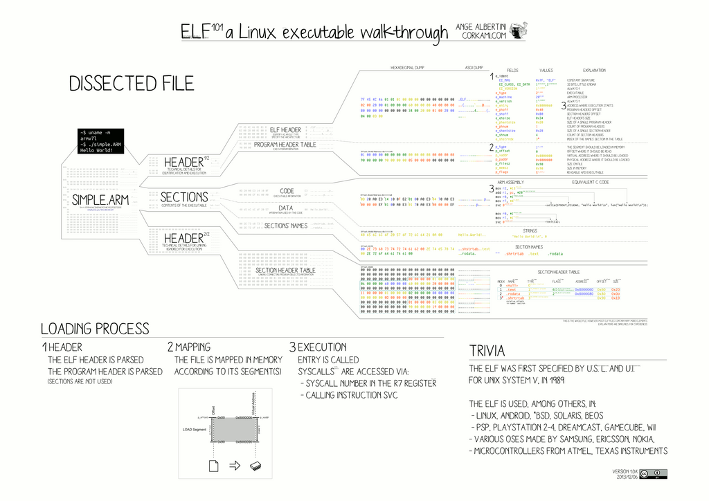

# Executable and Linkable Format (ELF)

EFL file layout 

## Header

For more, see https://en.wikipedia.org/wiki/Executable_and_Linkable_Format#

ELF header if defined as following:
- **e_ident**: An array of bytes that identifies the file as an ELF file. It contains information such as the file class (32-bit or 64-bit), endianness, and version.
	* **e_ident[EI_MAG0] -> e_ident[EI_MAG3]** (3 bytes): 0x7F followed by ELF(45 4c 46) in ASCII; these four bytes constitute the magic number.
	* **e_ident[EI_CLASS]** (1 byte): This byte is set to either 1 or 2 to signify 32- or 64-bit format, respectively.
	* **e_ident[EI_DATA]** (1 byte): This byte is set to either 1 or 2 to signify little or big endianness, respectively. This affects interpretation of multi-byte fields starting with offset 0x10
	* **e_ident[EI_VERSION]** (1 byte): Set to 1 for the original and current version of ELF.

- **e_type**: Specifies the type of the ELF file, such as executable, shared object, or relocatable object.

- **e_machine**: Specifies the target architecture for which the ELF file is intended.

- **e_version**: Specifies the version of the ELF file format.

- **e_entry**: The virtual address where the program execution starts.

- **e_phoff**: The offset in bytes to the program header table.

- **e_shoff**: The offset in bytes to the section header table.

- **e_flags**: Processor-specific flags associated with the ELF file.

- **e_ehsize**: The size of the ELF header in bytes.

- **e_phentsize**: The size of each entry in the program header table.

- **e_phnum**: The number of entries in the program header table.

- **e_shentsize**: The size of each entry in the section header table.

- **e_shnum**: The number of entries in the section header table.

- **e_shstrndx**: The index of the section header table entry that contains the section names.

## Sections

After the ELF header, the file contains a series of sections. Each section has a specific purpose and contains different types of data. Some common sections include:

- `.text`: Contains the executable code.
- `.data`: Contains initialized data.
- `.bss`: Contains uninitialized data.
- `.rodata`: Contains read-only data.
- `.symtab`: Contains symbol table information.
- `.strtab`: Contains string table information.

Importtant sections:

Section d'interpréteur :
* .interp : Cette section spécifie le nom du programme interpréteur utilisé pour exécuter le fichier. Elle est essentielle pour lancer le programme.

Sections de programme :
* .text : Contient le code exécutable du programme.
* .init : Contient le code d'initialisation du programme.
* .fini : Contient le code de finalisation du programme.
* .plt, .plt.got, .plt.sec : Sections utilisées pour la procédure de liaison dynamique, généralement nécessaires pour les appels de fonctions externes.

Sections de données :
* .rodata : Contient des données en lecture seule nécessaires à l'exécution du programme.

Table des en-têtes de section :
* Cette section (généralement appelée .shstrtab) contient les noms de toutes les sections. Bien qu'elle ne soit pas directement utilisée lors de l'exécution du programme, elle est souvent requise par le système d'exploitation pour lire et analyser le fichier ELF.

Table de symboles :
* .symtab : Contient les symboles du programme. Bien que vous souhaitiez supprimer les informations de débogage, cette section est souvent nécessaire pour le lien dynamique.

## Program Headers

After the sections, the file may contain program headers. Program headers describe the segments of the executable file that need to be loaded into memory. Each program header entry contains information such as the virtual address, file offset, and size of the segment.

## Dynamic Linking

ELF files also support dynamic linking, which allows the executable to use shared libraries at runtime. The dynamic linking information is stored in a section called `.dynamic`, which contains entries specifying the shared libraries needed by the executable.

## Relocation

Relocation is the process of adjusting the addresses in an executable file so that it can be loaded at a different address in memory. Relocation information is stored in a section called `.rela.text` or `.rel.text`, depending on the architecture.

# File Structure

+------------------------------------+
|          En-tête ELF               |
+------------------------------------+
|          En-têtes de programme     |
+------------------------------------+
|          En-têtes de section       |
+------------------------------------+
|          Données de section        |
+------------------------------------+
|          Segments                  |
+------------------------------------+
|          Données de segment        |
+------------------------------------+
